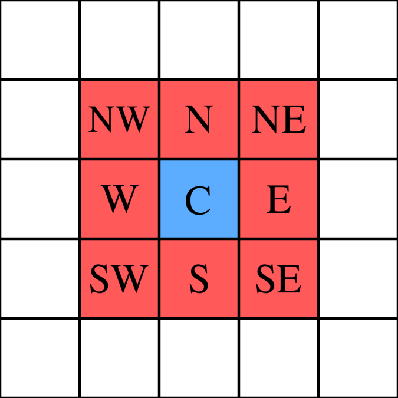

# Moore Neighbourhood.
Please feel free to comment and contribute towards this as I would love to learn more about it

> 

## So what is Moore Neighbourhood?
In cellular automata, the Moore neighborhood is defined on a two-dimensional square lattice and is composed of a central cell and the eight cells that surround it.